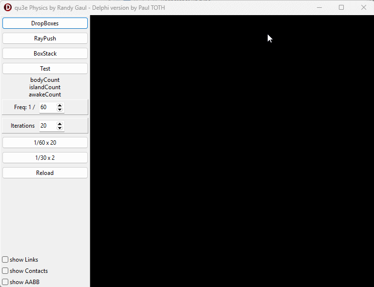

# Delphi.qu3e  
*A Delphi port of the excellent qu3e 3D physics engine by Randy Gaul*

Delphi.qu3e is a clean and modern Delphi port of **qu3e**, the lightweight and fast 3D physics engine originally created by **Randy Gaul**.  
The goal of this project is to provide a **fully self‑contained**, **Delphi‑friendly**, and **high‑performance** version of the engine, while staying faithful to the original design and spirit.

This project is released under the **GPL license**.

---

## ✨ Features

- 100% Delphi implementation — **no external C/C++ code**
- Entire engine contained in **one single unit**:  
  `RandyGaul.qu3e.pas`
- Faithful port of the original qu3e engine
- Optimized math routines (`q3Vec3`, `q3Mat3`, etc.)
- Custom paged allocators for bodies, boxes, and constraints
- Fully deterministic and stable rigid‑body simulation
- Broadphase using a Dynamic AABB Tree
- Contact generation and iterative constraint solver
- Clean and idiomatic Delphi code

---

## 📦 File Overview

### **`RandyGaul.qu3e_V1.pas`**
The **initial raw port** of qu3e.  
This version stays extremely close to the original C++ source code, with minimal Delphi‑specific adjustments.

### **`RandyGaul.qu3e_V2.pas`**
A **refined version** introducing more Delphi‑friendly constructs:
- clearer type usage  
- improved structure layout  
- better integration with Delphi’s memory model  

### **`RandyGaul.qu3e.pas`**
The **final optimized version**, redesigned with Delphi in mind:
- inlined math operations  
- optimized allocators  
- reduced overhead  
- improved performance  
- cleaner API  

This is the recommended version for real‑world use.

---

## 🧪 Demo Application

The project includes a working example:

### **`Demo1.dpr`**
A simple **Delphi VCL application using OpenGL** that demonstrates:
- creating a scene  
- adding bodies and boxes  
- stepping the physics simulation  
- rendering cubes with OpenGL  

This demo is intentionally minimal and easy to understand.

---

## 🛠 Requirements

- Delphi (tested with recent versions)
- OpenGL 2.1+ for the demo (or any backend you prefer)
- Windows 32/64‑bit

The engine itself does **not** depend on OpenGL — only the demo does.

---

## 📜 License

This project is released under the **GNU GPL License**.  
The original qu3e engine by Randy Gaul is also GPL‑licensed.

---

## 🙏 Credits

- **Randy Gaul** — for the original qu3e engine  
  <https://github.com/RandyGaul/qu3e>

- **Delphi.qu3e** — ported, adapted, and optimized for Delphi by *Execute SARL* (2026)

---

## 🤝 Contributions

Contributions, bug reports, and improvements are welcome.  
Feel free to open issues or submit pull requests.

---

## 📧 Contact

For questions or professional inquiries:  
**https://www.execute.fr**

